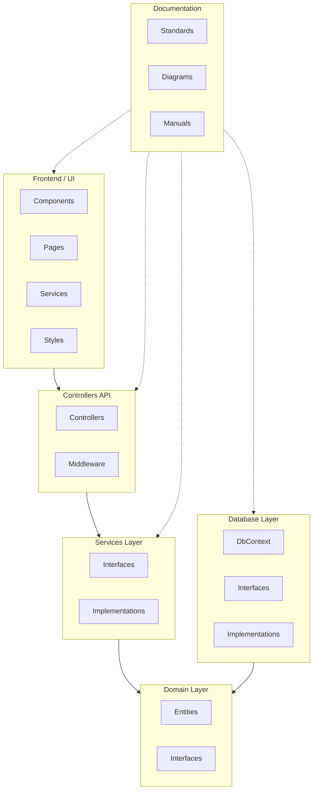

# 📘 Documento de Referencia de Arquitectura del Proyecto

## 1. Introducción
Este documento describe la estructura general del proyecto, basado en una **arquitectura en n-capas** siguiendo los principios de **Clean Architecture**. Su propósito es garantizar un diseño modular, desacoplado y mantenible, facilitando la colaboración del equipo y la evolución del sistema a largo plazo.  

El proyecto se organiza en **cuatro repositorios principales**:
- **Backend**  
- **Frontend (UI)**  
- **Database**  
- **Docs**  

Cada uno cumple un rol independiente pero interconectado dentro del sistema.

---

## 2. Estructura de Capas

### 2.1. **Capa de Dominio (Domain)**
- **Subcarpetas:**  
  - `Entities`: Define las entidades del negocio con sus atributos y reglas básicas de validación.  
  - `Interfaces`: Define contratos abstractos (repositories, servicios de dominio, etc.).  

- **Responsabilidad:**  
  Contiene la lógica de negocio pura y las reglas que no dependen de infraestructura ni frameworks.  

---

### 2.2. **Capa de Servicios (Services)**
- **Subcarpetas:**  
  - `Interfaces`: Define los contratos de los servicios de aplicación.  
  - `Implementations`: Contiene la implementación concreta de esos contratos.  

- **Responsabilidad:**  
  Orquesta los casos de uso. Traduce las necesidades del negocio (Dominio) a operaciones prácticas.  

---

### 2.3. **Capa de Acceso a Datos (Database)**
- **Subcarpetas:**  
  - `DbContext`: Configuración de la conexión a la base de datos y mapeo de entidades.  
  - `Interfaces`: Contratos de acceso a datos.  
  - `Implementations`: Repositorios concretos que implementan la persistencia.  

- **Responsabilidad:**  
  Gestiona el acceso y persistencia de datos en la base de datos (ORM, queries SQL, etc.).  

---

### 2.4. **Capa de Controladores de API (ControllersApi)**
- **Subcarpetas:**  
  - `Controllers`: Exponen endpoints al exterior (REST, GraphQL, etc.).  
  - `Middleware`: Manejo de autenticación, validaciones, logging, excepciones, etc.  

- **Responsabilidad:**  
  Actúa como punto de entrada a la aplicación. Traduce peticiones externas a llamadas a servicios.  

---

### 2.5. **Capa de Interfaz de Usuario (Frontend/UI)**
- **Posible estructura:**  
  - `Components`: Componentes reutilizables.  
  - `Pages`: Vistas principales.  
  - `Services`: Consumo de APIs y gestión de estado.  
  - `Styles`: Estilos globales y temas.  

- **Responsabilidad:**  
  Presenta la información al usuario y gestiona su interacción con el sistema. Depende de la **ControllersApi** para obtener y enviar datos.

---

### 2.6. **Repositorio de Documentación (Docs)**
- **Contenido esperado:**  
  - Diagramas de arquitectura  
  - Convenciones y estándares  
  - Manuales técnicos y de usuario  

- **Responsabilidad:**  
  Centralizar la documentación del proyecto para referencia del equipo.  

---

## 3. Reglas de Dependencia (Clean Architecture)
- **Regla de oro:** Las dependencias siempre apuntan hacia el **Dominio**.  
- El **Dominio** nunca depende de infraestructura ni frameworks.  
- La **UI** y los **Controladores API** son los más externos y pueden cambiar sin afectar el núcleo.  

---

## 4. Estándares de Código y Naming Conventions

### 4.1. **Naming**
- **Clases, Interfaces y Métodos Públicos:** `PascalCase`  
  - Ejemplo: `UserService`, `OrderController`, `IRepository`  
- **Variables locales y parámetros:** `camelCase`  
  - Ejemplo: `orderList`, `userId`  
- **Archivos:** un archivo por clase/interfaz.  
  - Ejemplo: `UserService.cs`, `IUserRepository.cs`  
- **Campos privados:** prefijo con underscore `_`  
  - Ejemplo: `_connectionString`  

---

### 4.2. **Buenas Prácticas**
- **Nombres descriptivos:** Evitar abreviaturas innecesarias (`customerId` en lugar de `cid`).  
- **Nullable:** Usar tipos anulables (`string?`, `int?`) para campos opcionales.  
- **Comentarios:** Usar `docstrings` para describir métodos, parámetros y retorno.  
- **Organización:**  
  - Clases pequeñas y cohesivas.  
  - Métodos cortos y con una sola responsabilidad.  
- **Tests:** Toda lógica de negocio debe estar cubierta por pruebas unitarias.  

---

## 5. Flujo de Trabajo
- **Planificación:** `Issues` en Kanban board
- **Desarrollo:** `Feature branches` desde `develop`
- **Review:** `Pull requests` con aprobaciones obligatorias
- **Testing:** En la rama `develop` antes de producción
- **Deploy:** `Merge` a `main` solo código aprobado

---

### 5.1 GitHub Organization Workflow Setup
- Crear rama personal desde develop
```bash
  git checkout develop
  git pull origin develop 
  git checkout -b feature/nombre-descriptivo
```
- Trabajar en tu rama personal
```bash
  git add .
  git commit -m "feat: descripción"
  git push -u origin feature/nombre-descriptivo 
```
- Pull Request desde tu feature → develop
- Code reivew y merge 
- Eliminar la rama de feature 
```bash
  git checkout develop
  git branch -d feature/nombre-descriptivo
  git push origin --delete feature/nombre-descriptivo
```

---

### 5.2 Prefijos Obligatorios
- **Nuevas funcionalidades:** `feature/nombre-descriptivo`
- **Correción de bugs no críticos:** `bugfix/nombre-descriptivo`
- **Prototipos:** `experiment/nombre-descriptivo`
- **Bugs críticos en producción:** `hotfix/nombre-descriptivo`
- **Preparación de releases:** `release/v1.2.0`, `v2.0.0-beta`
---

## 6. Control de Versiones a Escala 
- **main:** Código estable en producción
- **develop:** Integración continua del equipo
- **prototype:** Experimentación 

---

## 5. Resumen Visual (flujo de dependencias)

```
UI (Frontend) → ControllersApi → Services → Domain ← Database
```

---

## 6. Diagrama de Arquitectura (Mermaid)



---

📑 Este documento deberá mantenerse actualizado en el repositorio **Docs** para servir como referencia de todo el equipo durante el ciclo de vida del proyecto.
